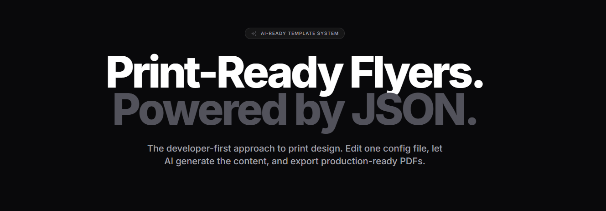

# Run and deploy your AI Studio app

This contains everything you need to run your app locally.

View your app in AI Studio: <https://ai.studio/apps/drive/1z_4Bkok1Z084Jd2f_prylbsDem6lbl4k>

## Run Locally

**Prerequisites:**  Node.js

1. Install dependencies:
   `npm install`

2. Run the app:
   `npm run dev`
