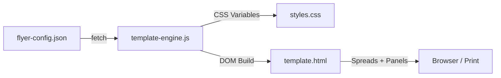

# 🎨 Flyer Designer – AI-Ready Template System

> **Fork this project** and create stunning print flyers powered by AI. Just edit one JSON file — colors, format, layout — and let AI fill in the content.

[](https://opensource.org/licenses/MIT)

---

## ✨ Features

- 🎨 **JSON-driven design** — Colors, fonts, branding all in one config file
- 📐 **Multiple formats** — A5 (148×210mm) and A6 (105×148mm), portrait or landscape
- 📄 **Flexible layouts** — Simple greeting card, 2-fold (4 panels), 3-fold (6 panels)
- 🖨️ **Print-ready** — `Ctrl+P` or click the print button, WYSIWYG output
- 🤖 **AI-ready** — Empty template with placeholders, designed for AI content injection
- 📏 **Spread view** — Panels displayed side-by-side like the physical sheet, with fold lines

---

## 🚀 Quick Start

```bash
# 1. Fork & clone
git clone https://github.com/YOUR_USERNAME/FlyerDesigner.git
cd FlyerDesigner

# 2. Open in browser (use Live Server or any local server)
# The template-engine.js fetches flyer-config.json via fetch(),
# so a local server is required (file:// won't work for fetch).
npx -y serve .
```

Open `http://localhost:3000/template.html` and you'll see your empty flyer template with placeholder panels.

---

## 🏗️ Architecture



| File | Purpose |
| ------ | ------- |
| `flyer-config.json` | All settings: colors, format, layout, fonts, branding, panel content |
| `template.html` | HTML shell with Tailwind CSS, print button, dynamic container |
| `template-engine.js` | Reads JSON config → sets CSS variables → builds spreads & panels |
| `styles.css` | Spread layout, fold lines, cards, icons, print styles |

---

## ⚙️ Configuration (`flyer-config.json`)

### 🎨 Colors

```json
"colors": {
    "primary": "#FFC700",
    "primaryText": "#050505",
    "secondary": "#050505",
    "secondaryText": "#FCFCFC",
    "background": "#FCFCFC",
    "textMain": "#050505",
    "textMuted": "#64748B",
    "accent": "#FFC700",
    "border": "#E2E8F0"
}
```

### 📐 Format & Orientation

```json
"format": {
    "active": "A6",
    "orientation": "hochformat",
    "options": {
        "A5": { "width": "148mm", "height": "210mm" },
        "A6": { "width": "105mm", "height": "148mm" }
    }
}
```

### 📄 Layout

```json
"layout": {
    "active": "einfach",
    "options": {
        "einfach":  { "label": "Einfache Grußkarte", "panels": 2 },
        "2-falz":   { "label": "2-Falz",             "panels": 4 },
        "3-falz":   { "label": "3-Falz (Wickelfalz)", "panels": 6 }
    }
}
```

### 📝 Panel Content

Each panel supports `heading`, `subheading`, `body` (HTML), and `footer`:

```json
"panels": {
    "1": {
        "role": "cover",
        "heading": "Your Headline",
        "subheading": "TAGLINE",
        "body": "<p>Rich HTML content here</p>",
        "footer": "© 2026 Your Company"
    }
}
```

---

## 🧩 Available CSS Utility Classes

Use these classes in the `body` field of your panels for quick styling:

| Class | Description |
| ----- | ----------- |
| `.card` | White rounded card with border |
| `.card--primary` | Card with primary background color |
| `.card--dark` | Dark card (gray-900) with white text |
| `.card--soft` | Subtle primary-tinted card |
| `.card--pattern` | Cross-pattern overlay (use on `.card--primary`) |
| `.icon-box` | Circular icon container |
| `.icon-box--primary-soft` | Icon box with soft primary bg |
| `.section-header` | Centered section header with underline |
| `.cta-block` | Dark CTA / QR code section |
| `.step-dot` | Small colored dot for step indicators |
| `.big-number` | Large faded number (benefit-style) |
| `.brand-vertical` | Vertical brand text (absolute positioned) |
| `.mono-label` | Monospace uppercase label |

---

## 🤖 AI Usage

This template is designed for AI-powered flyer generation:

1. **AI reads** `flyer-config.json` to understand the design constraints
2. **AI fills** the `panels` section with content (headings, body HTML, footers)
3. **AI adjusts** colors and branding to match the client
4. **Result** opens in browser → print-ready flyer

### Example Prompt

```text
Create a flyer for "Café Sonnenschein" using the FlyerDesigner template.
Format: A5, Layout: 2-falz.
Primary color: #2D5016 (forest green), Secondary: #F5E6D3 (cream).
Fill all 4 panels with café menu highlights, opening hours, and a welcome message.
Update flyer-config.json accordingly.
```

---

## 🖨️ Printing

1. Open `template.html` in browser
2. Press `Ctrl+P` or click **FLYER DRUCKEN**
3. Set margins to **None**
4. Enable **Background graphics**
5. Print or save as PDF

---

## 📁 Project Structure

```text
FlyerDesigner/
├── flyer-config.json      ← Design settings (colors, format, layout)
├── template.html          ← HTML template (Tailwind + dynamic container)
├── template-engine.js     ← JS engine (reads config, builds DOM)
├── styles.css             ← Base styles (spreads, fold lines, components)
└── README.md              ← You are here
```

---

## 📜 License

MIT — Feel free to fork, modify, and use for your projects.
